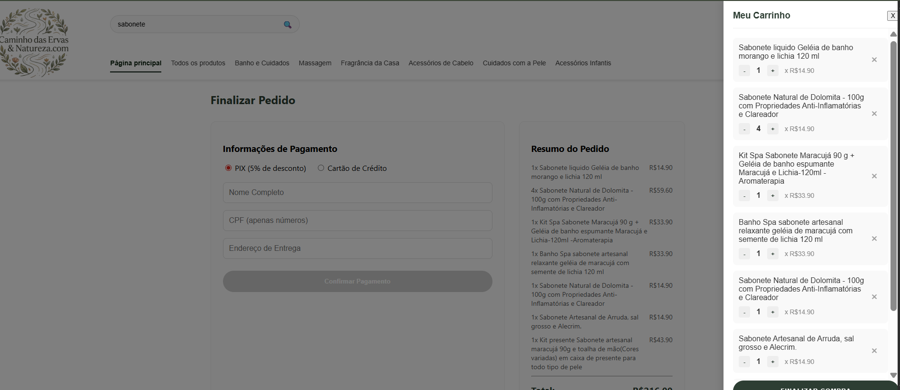
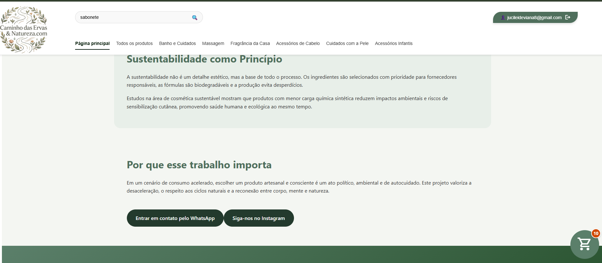

## 📸 Demonstração do Projeto

### Página Inicial


### Galeria de Produtos


### Galeria de Produtos


### Galeria de Produtos



# 🌿 Caminho das Ervas - E-commerce Artesanal

Este é um projeto de e-commerce completo (Full Stack) desenvolvido para a loja **Caminho das Ervas**, especializada em produtos naturais e rituais de autocuidado. O sistema destaca-se pela gestão dinâmica de catálogo através de planilhas.

## Diferencial Técnico: Gestão via Excel
Diferente de e-commerces tradicionais onde o cadastro é manual via formulário, este projeto implementa um **serviço de ingestão de dados automatizado**:
- **Fonte de Dados:** Um arquivo `.xlsx` (Excel) centraliza o estoque, preços e caminhos de imagens.
- **Processamento:** O backend em Node.js lê a planilha utilizando a biblioteca `XLSX`, valida os campos e sincroniza os dados com um banco de dados **SQLite**.
- **Automação:** Toda vez que o servidor é iniciado, ele verifica atualizações na planilha e reflete as mudanças instantaneamente na vitrine do Angular.

### 🔧 Pré-requisitos
- **Node.js** (v18 ou superior)
- **Angular CLI** (v17 ou superior)
- **VS Code** (recomendado)

## 🛠️ Tecnologias Utilizadas

### Front-end
- **Angular 17+**: Utilizando as novas syntax control blocks (`@for`, `@if`).
- **CSS3**: Layout responsivo e estilização customizada.
- **TypeScript**: Tipagem forte para garantir a integridade dos dados dos produtos.

### Back-end
- **Node.js & Express**: API REST para servir os dados ao front-end.
- **SQLite3**: Banco de dados leve e eficiente para armazenamento local.
- **XLSX**: Biblioteca para parsing e leitura de arquivos Excel.

## 📋 Como Funciona a Importação

1. O administrador atualiza a planilha `produtos_loja.xlsx` na raiz do projeto.
2. O servidor Node.js realiza o `parse` dos dados.
3. O banco de dados `database.db` é limpo e repovoado com as informações atualizadas.
4. O Front-end consome a rota `/api/produtos` e renderiza os cards com as imagens armazenadas em `assets/img/`.

## ⚙️ Como Executar o Projeto

1. **Clone o repositório:**
   ```bash
   git clone https://github.com
   ```

2. **Instale as dependências:**
   ```bash
   # No diretório raiz
   npm install
   ```

3. **Inicie o Backend:**
   ```bash
   node backend/server.js
   ```

4. **Inicie o Front-end:**
   ```bash
   ng serve
   ```
   Acesse: `http://localhost:4200`

---
Desenvolvido por **Jucileide Viana**
**Anderson Marques da Silva**
**Bianca Medeiros Labiapari**
**Matheus da Silva Bissolati**
